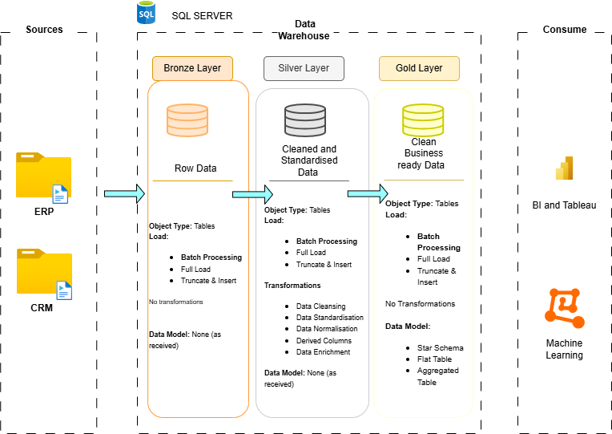
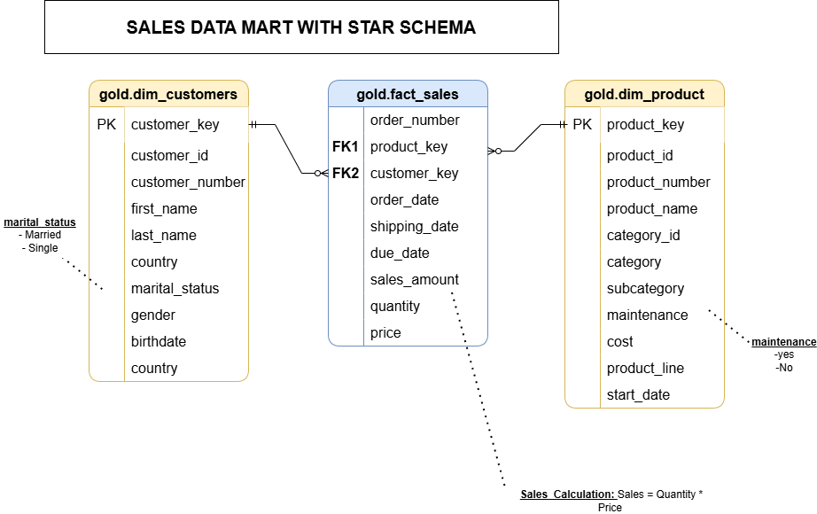
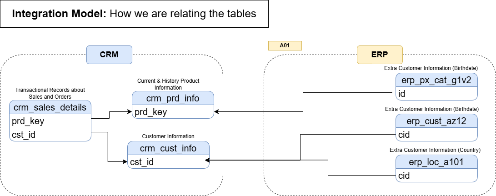

# SQL Data Warehouse Project  
**From Raw Data to Business-Ready Insights**

---

## Project Overview

This repository showcases the design and implementation of a modern **SQL Server–based data warehouse**, built end to end to transform raw, fragmented data into a clean, structured, and analytics-ready model.

The solution follows the **Medallion Architecture** (Bronze, Silver, Gold), a widely adopted industry pattern that separates concerns, improves data quality, and supports scalable reporting and analytics.

---

## Business Problem & Objectives

In this business setup, analysts rely heavily on manual data extraction and transformation across multiple systems. This results in slow turnaround times, inconsistent metrics, and limited trust in reporting outputs.

The objectives of this project are to:

- **Centralise Data**  
  Integrate customer, product, and sales data from multiple source systems (CRM and ERP) into a single warehouse.

- **Improve Data Quality**  
  Address common data issues such as duplicates, null values, invalid records, and inconsistent formats before analysis.

- **Enable Analytics & Reporting**  
  Deliver a simplified, business-facing data model (no historisation required) optimised for querying and reporting.

- **Provide Clear Documentation**  
  Supply technical documentation, data models, and architectural context to support both technical and business users.

---

## Data Flow & Lineage

The diagram below illustrates how data moves from source systems through the Bronze, Silver, and Gold layers, including transformation and enrichment steps.

---

## Data Sources

The warehouse ingests data from two simulated operational systems, provided as CSV files:

### CRM System
- `customer_info` – Core customer attributes  
- `product_info` – Product catalog and pricing history  
- `sales_details` – Transaction-level sales data  

### ERP System
- `cust_az12` – Additional customer demographics (gender, birth date)  
- `loc_a101` – Customer location data  
- `px_cat_g1v2` – Product category and subcategory hierarchy  

---

## ETL & Data Processing Approach

The ETL pipeline is implemented entirely in **SQL Server** using stored procedures.

### Key Design Choices

- **Ingestion:**  
  High-performance loading using `BULK INSERT`.

- **Silver Layer Transformations:**
  - Null handling using default values (`'n/a'`, `0`)
  - Standardisation of coded fields (e.g. `M` / `F` → `Male` / `Female`)
  - Deduplication using `ROW_NUMBER()` window functions
  - Business-rule validation (e.g. `Sales = Quantity × Price`)
  - Date range correction using `LEAD()` for continuous timelines

- **Automation:**  
  Logic wrapped in layer-specific stored procedures:
  - `load_bronze`
  - `load_silver`
  - `load_gold`

- **Monitoring & Reliability:**  
  - `TRY...CATCH` blocks for error handling  
  - Custom logging to capture execution time and load status  

---

## Data Modelling & Gold Layer Design

The Gold Layer is designed using a **Star Schema**, optimised for analytical queries and BI tools.

### Sales Data Mart (Star Schema)

### Data Integration Model

The model below shows how CRM and ERP data are integrated to form conformed dimensions and facts.

---

## Analytics & Reporting – Business Insights

### Objective

Develop SQL-based analytical outputs to generate insights into:

- Customer behaviour  
- Product performance  
- Sales trends  

These outputs support **data-driven decision-making** through consistent and reliable business metrics.

For additional analytical requirements, see:  
`docs/requirements.md`

---

## Tools & Technologies

- **Database:** Microsoft SQL Server (Express Edition)  
- **IDE:** SQL Server Management Studio (SSMS)  
- **Design & Modelling:** Draw.io (ERD and data flow diagrams)  
- **Project Management:** Notion  
- **Version Control:** Git & GitHub  

---

## Key Outcomes

- Integrated CRM and ERP data into a unified analytical model.  
- Resolved critical data quality issues (e.g. invalid dates, negative sales).  
- Implemented metadata tracking for auditability.  
- Produced supporting documentation including a Data Catalog and Data Lineage diagrams.  

---

## Credits

- Credit to **Data with Baraa** for providing the datasets used in this project.

---

## License

This project is released under the **MIT License**.  
You are free to use, modify, and distribute this work with appropriate attribution.

---
